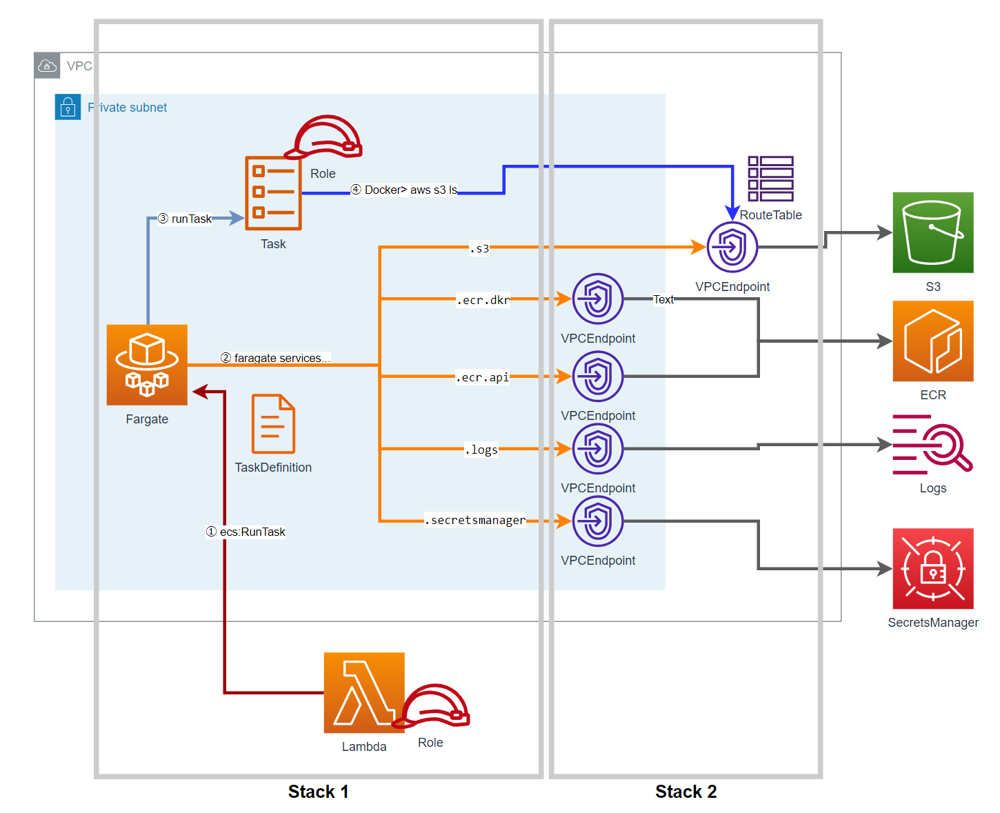

# README

## contents
Two template for buldindg fargate enviromnent. 
- stack1: fargateTaskRunTemplate.yaml
- stack2: interfaceEndpoint.yaml

One bash file for create-stack action.
- deploy.bash

Sample files for docker
- Container

## image
